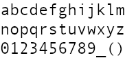
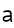
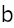
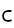

# gosplit
gosplit is tool for split image.

# install
````
go install github.com/desktopgame/gosplit/cmd/gosplit
````

# format
````
gosplit -r $rowCount -c $columnCount -i $input_file
````

# example
````
gosplit -r 3 -c 13 -i /Users/koya/Documents/Gimp/AlphaMapFill_14x28.png
````

# screenshot
input image  


command
````
gosplit -r 3 -c 13 -i /Users/koya/go/src/github.com/desktopgame/gosplit/image/AlphaMapFill_14x28.png
````
output image  
  
  
  
  